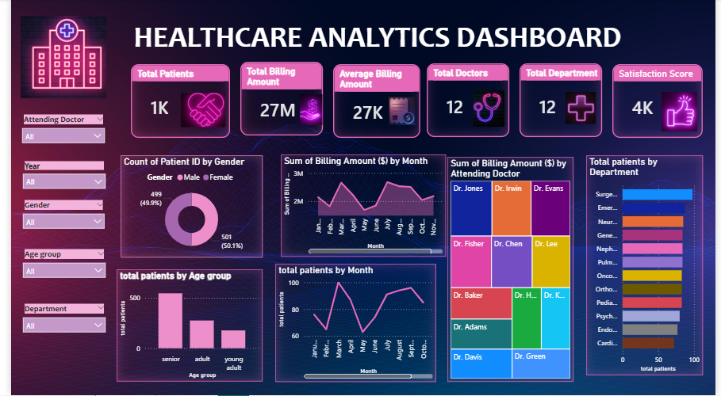

# Healthcare Analytics Dashboard

## 📊 Project Overview

This project is an interactive healthcare data analysis dashboard created using Microsoft Power BI.

The dashboard provides meaningful insights into patient data, billing amounts, hospital departments, doctors, and patient satisfaction.

## 🛠️ Tools Used

- Microsoft Power BI
- Power Query
- DAX
- Microsoft Excel

## 📌 Key KPIs

- Total Patients
- Total Billing Amount
- Average Billing Amount
- Total Doctors
- Total Departments
- Patient Satisfaction Score

## 📈 Dashboard Features

- Patient analysis by month
- Billing amount analysis
- Department-wise patient analysis
- Doctor-wise billing analysis
- Interactive slicers and filters
- KPI cards
- Data visualizations

## 💡 Key Insights

- Analyzed patient trends over time.
- Compared billing amounts across doctors and departments.
- Analyzed patient distribution across different departments.
- Evaluated patient satisfaction using interactive dashboard visuals.

## 👩‍💻 Created By

Nishana P Alikutty

Aspiring Data Analyst

## 📸 Dashboard Preview

